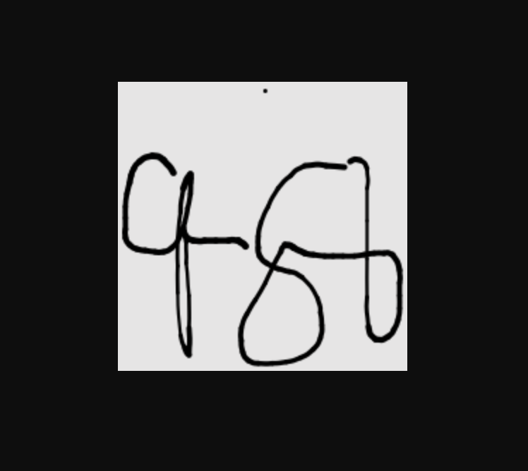

# Steps

Run the following:

```shell
npm install
npm run build
cd build
node .
```

Then, go to:

```
http://localhost:3000/api/demo.png
```

The above will fail with:

```
Error: Could not load the "sharp" module using the darwin-arm64 runtime
undefined: Could not dynamically require "../src/build/Release/sharp-darwin-arm64.node". Please configure the dynamicRequireTargets or/and ignoreDynamicRequires option of @rollup/plugin-commonjs appropriately for this require call to work.
undefined: Could not dynamically require "../src/build/Release/sharp-wasm32.node". Please configure the dynamicRequireTargets or/and ignoreDynamicRequires option of @rollup/plugin-commonjs appropriately for this require call to work.
undefined: Could not dynamically require "@img/sharp-darwin-arm64/sharp.node". Please configure the dynamicRequireTargets or/and ignoreDynamicRequires option of @rollup/plugin-commonjs appropriately for this require call to work.
undefined: Could not dynamically require "@img/sharp-wasm32/sharp.node". Please configure the dynamicRequireTargets or/and ignoreDynamicRequires option of @rollup/plugin-commonjs appropriately for this require call to work.
Possible solutions:
- Ensure optional dependencies can be installed:
    npm install --include=optional sharp
    yarn add sharp --ignore-engines
- Ensure your package manager supports multi-platform installation:
    See https://sharp.pixelplumbing.com/install#cross-platform
- Add platform-specific dependencies:
    npm install --os=darwin --cpu=arm64 sharp
- Consult the installation documentation:
    See https://sharp.pixelplumbing.com/install
    at requireSharp (file:///Users/devcsrj/Projects/devcsrj/sveltekit-sharp/build/server/chunks/_server.ts-XFgYmyCb.js:3501:10)
```

On dev mode however, it works fine with:


